# 🛰️ Автоматическое обнаружение изменений на изображениях площадной съемки

  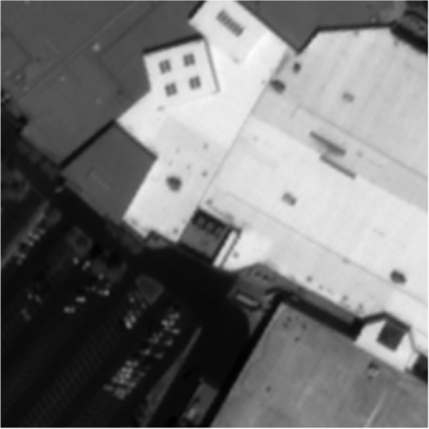
  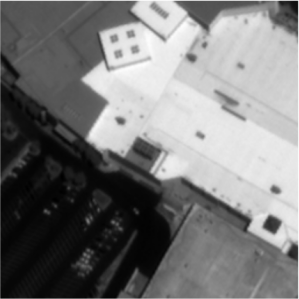
  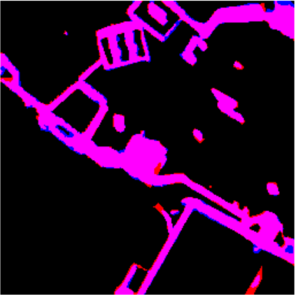
  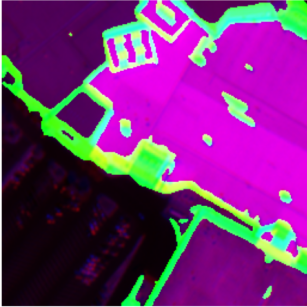

---

Данный репозиторий представляет собой результаты выпускной квалификационной работы бакалавра по направлению «Программная инженерия» в РГРТУ им. В.Ф. Уткина (защищена в 2026 году).

В рамках проекта был обучен нейросетевой детектор изменений на высокодетальных изображениях площадной съемки космических аппаратов для интеграции в ГИС-комплекс. Детектор предназначен для автоматического расчета масок штрафов, позволяющих обходить изменения сюжета при построении линий пореза мозаичных изображений.

---

## 📑 Содержание

- [🛰️ Автоматическое обнаружение изменений на изображениях площадной съемки](#️-автоматическое-обнаружение-изменений-на-изображениях-площадной-съемки)
  - [📑 Содержание](#-содержание)
  - [📝 Описание и актуальность](#-описание-и-актуальность)
  - [🧠 Математический аппарат и ML-архитектура](#-математический-аппарат-и-ml-архитектура)
    - [📐 Математическая постановка задачи](#-математическая-постановка-задачи)
    - [🏗️ Архитектура U-Net++ с энкодером ResNet-34](#️-архитектура-u-net-с-энкодером-resnet-34)
    - [⚖️ Борьба с дисбалансом классов и обучение](#️-борьба-с-дисбалансом-классов-и-обучение)
  - [📊 Метрики качества модели](#-метрики-качества-модели)
  - [🗺️ Влияние детектора изменений на построение линии пореза](#️-влияние-детектора-изменений-на-построение-линии-пореза)
    - [Сюжет 1: С высотными объектами и явным эффектом параллакса](#сюжет-1-с-высотными-объектами-и-явным-эффектом-параллакса)
    - [Сюжет 2: Без высотных объектов](#сюжет-2-без-высотных-объектов)
  - [📢 Апробация работы, конференции и публикации](#-апробация-работы-конференции-и-публикации)
    - [Внедрение результатов](#внедрение-результатов)
    - [Участие в конференциях](#участие-в-конференциях)
    - [Публикации](#публикации)
  - [📸 Демонстрация нейросетевой сегментации](#-демонстрация-нейросетевой-сегментации)

## 📝 Описание и актуальность

Современные оптические космические аппараты выполняют съемку в различных режимах в зависимости от решаемых задач. В частности, в режиме **площадной** съемки, применяющейся для формирования единого мозаичного покрытия, превышающего ширину полосы захвата на одном витке полета спутника.

  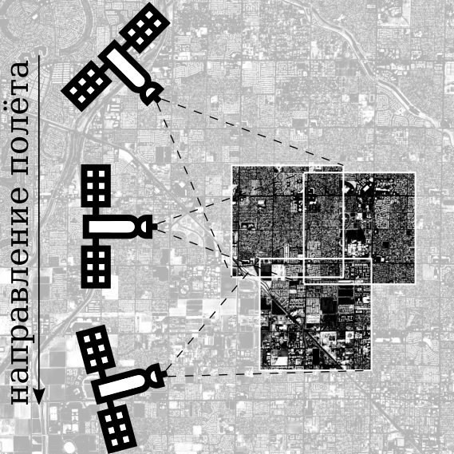
  
<i>Площадной режим съемки космических аппаратов</i>

На завершающем этапе формирования мозаики проводится линия пореза смежных областей. Она должна обходить зоны изменения сюжета, иначе на итоговом ортофотоплане возникают визуальные артефакты. Изменения зачастую обусловлены сменой сюжета при перенацеливании аппаратуры, неточной геопривязкой, а также искажениями (эффектом параллакса) от высотных объектов.

  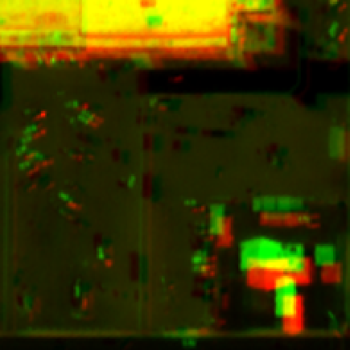
  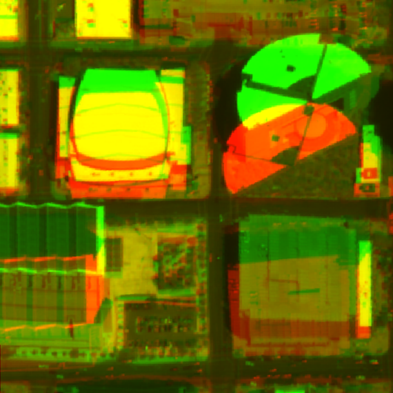
  
<i>Примеры возникающих изменений</i>

Отсюда актуальна задача **автоматического обнаружения изменений** для повышения качества выходных продуктов. В качестве решения предлагается использовать полученную нейросетью карту изменений в качестве стоимостной функции (маски штрафов) для автоматического «обхода» измененных зон при построении линии пореза.

---

## 🧠 Математический аппарат и ML-архитектура

### 📐 Математическая постановка задачи

Пусть даны изображения $I^{(1)}, I^{(2)} \in \mathbb{R}^{H \times W \times C}$ (геометрически согласованная пара снимков, $C=1$ для панхроматических каналов), область их перекрытия $\Omega$ и параметры модели $\theta$.

Используется парадигма **раннего слияния**. Входные тензоры объединяются по каналам до первого сверточного слоя:
$$X = [I^{(1)}, I^{(2)}] \in \mathbb{R}^{H \times W \times 2}$$

Нейронная сеть аппроксимирует функцию $f_\theta$, возвращающую вероятностную карту изменений:
$$\hat{Y} = f_\theta(X), \quad \hat{Y} \in [0, 1]^{H \times W}$$

Итоговая карта классов $M(x,y) \in \{0, 70, 255\}^{H \times W}$ формируется по правилу:
$$M(x,y) = \begin{cases} 
255, & P_\theta(x,y) \ge \tau \text{ и } (x,y) \in \Omega \quad \text{(семантическое изменение)},\\
70, & P_\theta(x,y) < \tau \text{ и } (x,y) \in \Omega \quad \text{(стабильный фон)},\\
0, & (x,y) \notin \Omega \quad \text{(нет данных)}.
\end{cases}$$
где $\tau$ — настраиваемый порог бинаризации.

---

### 🏗️ Архитектура U-Net++ с энкодером ResNet-34

Для устранения проблемы «семантического разрыва» выбрана архитектура **U-Net++**. В качестве энкодера был выбран **ResNet-34** с предобученными весами (ImageNet).

  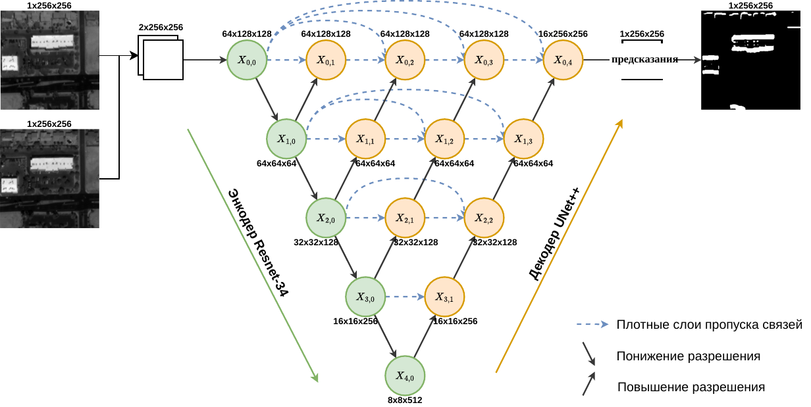
  
<i>Структурная схема архитектуры нейронной сети U-Net++ с энкодером ResNet-34</i>

### ⚖️ Борьба с дисбалансом классов и обучение

При анализе спутниковых данных было выявлено, что $\approx 85\%$ площади всех снимков остаются стабильными (класс фонового изображения доминирует). Обучение сети в таких условиях ведет к тривиальному предсказанию стабильного класса. Для борьбы с таким дисбалансом было выполнено:

1. **Фильтрация и балансировка выборки:**  
   Вся исходная съемка нарезалась скользящим окном $256 \times 256$ с перекрытием 50%. Для каждого фрагмента рассчитывался коэффициент заполнения изменениями $\rho$:
   $$\rho = \frac{1}{H_p \cdot W_p} \sum_{i=1}^{H_p} \sum_{j=1}^{W_p} Y(i,j)$$
   В финальный датасет включались **все** фрагменты с $\rho \ge 0.01$, а из полностью пустых фрагментов ($\rho < 0.01$) отбиралось лишь **15%** методом случайного сэмплирования.
2. **Использование комбинированной функции потерь:**  
   Для коррекции весов использовалась взвешенная сумма:
   $$\mathcal{L} = 0.7 \cdot \mathcal{L}_{dice} + 0.3 \cdot \mathcal{L}_{focal}$$
   * **Dice Loss** обеспечивает геометрическое подобие и связность контуров изменений.
   * **Focal Loss** с параметром $\gamma = 2.0$ принудительно зануляет градиенты от легко классифицируемых фоновых пикселей, фокусируя обучение на границах и сложных паттернах.
3. **Оптимизация:** Оптимизатор **AdamW** в сочетании с косинусным планировщиком скорости обучения.

Обучение проводилось на облачных GPU в Google Colab на 2070 парах фрагментов с КА «Ресурс-П» №1 (пространственное разрешение $\approx 0.8$м). Эталонная выборка была размечена вручную в программе QGIS.

---

## 📊 Метрики качества модели

| Метрика | Значение |
| :--- | :---: |
| **Precision** | `0.8680` |
| **Recall** | `0.8614` |
| **F1-Score** | **`0.8647`** |
| **IoU (Jaccard Index)** | **`0.7616`** |
| **Specificity** | `0.9843` |

Для обеспечения объективности оценок и исключения переобучения применялась схема **5-кратной стратифицированной кросс-валидации**. Отклонение ключевых метрик качества на разных фолдах в процессе валидации составило сотые доли, что подтверждает высокую стабильность модели и репрезентативность подготовленных обучающих данных.

Итоговая модель была обучена на выборке при разделении в соотношении 90/10 (обучение/тест). Обучение с косинусным планировщиком стабильно сходится к 100-й эпохе, демонстрируя плавное снижение функции потерь на обучающем и тестовом множествах, после чего начинается переобучение модели. Количественные показатели качества сегментации на тестовом подмножестве подтверждают высокую точность предложенного ML-решения.

  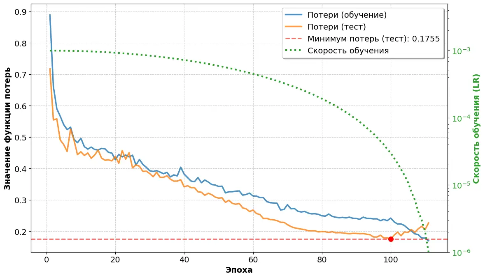
  
<i>График функций потерь и скорости обучения</i>

---

## 🗺️ Влияние детектора изменений на построение линии пореза

Для оценки практической эффективности разработанного подхода ниже приведено сравнение результатов проведения линии пореза для двух характерных сценариев.

### Сюжет 1: С высотными объектами и явным эффектом параллакса
*Исходная пара изображений:*

  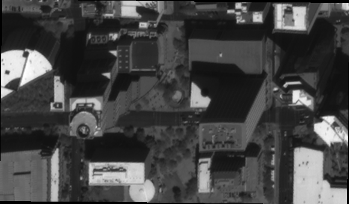
  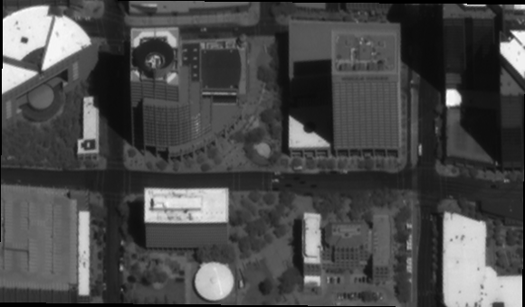

*Результат:*
| Метод | Стоимостная карта | Композит | Мозаика |
| :---: | :---: | :---: | :---: |
| **Градиентный** | 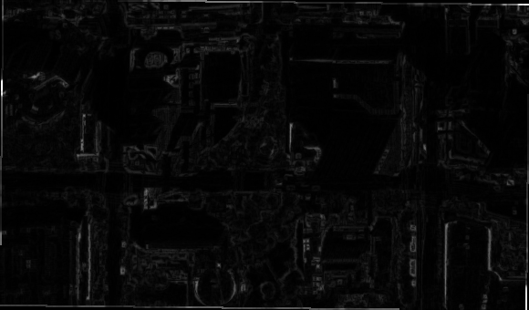 | 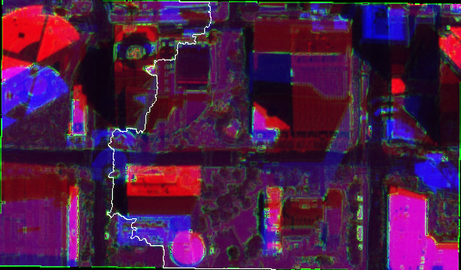 | 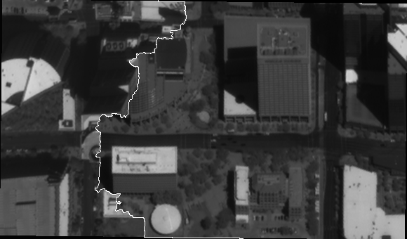 |
| **Изменения** | 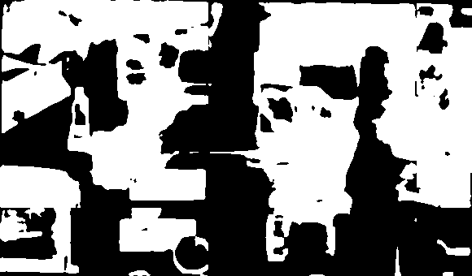 | 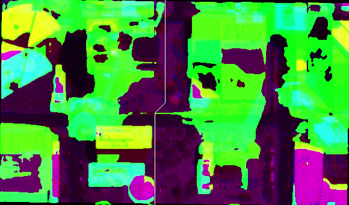 | 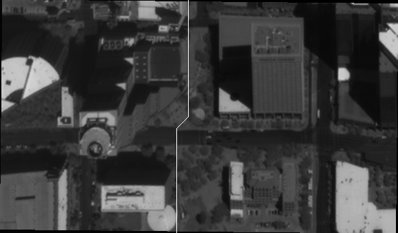 |

* **Результат:** В базовом градиентном методе линия пореза проходит непосредственно через высотные объекты, из-за чего на итоговой мозаике возникают сильные искажения. Применение нейросетевой маски изменений позволяет алгоритму автоматически обойти все изменения и сформировать мозаику без дефектов.

---

### Сюжет 2: Без высотных объектов
*Исходная пара изображений:*

  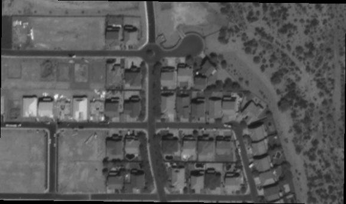
  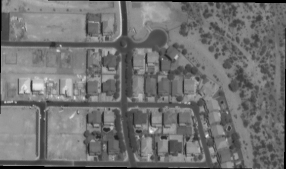

*Результат:*
| Метод | Стоимостная карта | Композит | Мозаика |
| :---: | :---: | :---: | :---: |
| **Градиентный** | 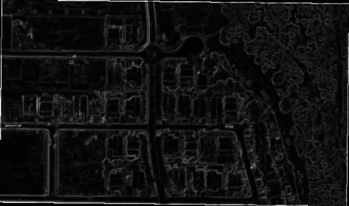 | 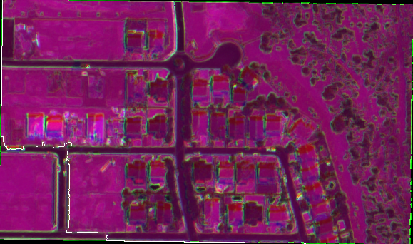 | 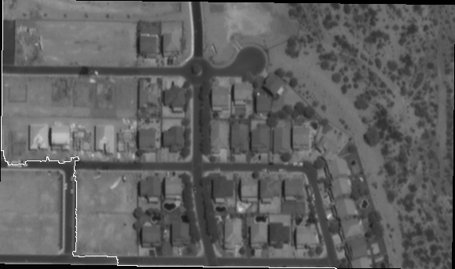 |
| **Изменения** | 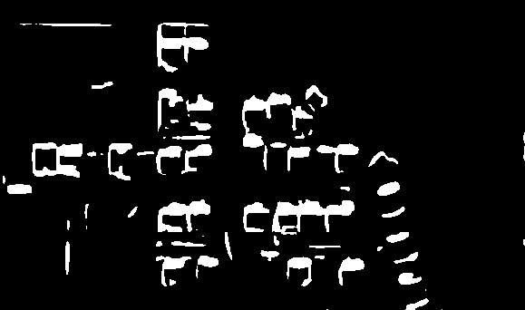 | 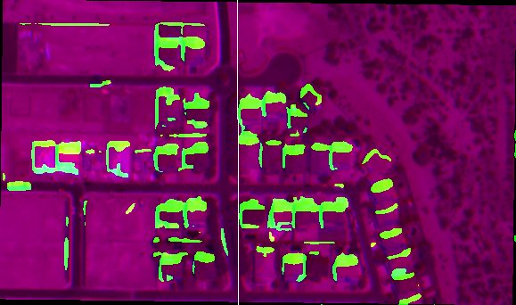 | 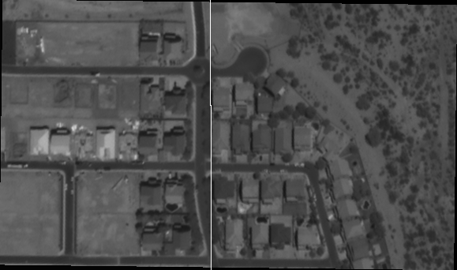 |

* **Результат:** В данном сценарии градиентная карта штрафов справляется со своей задачей, результат получается стабильный. Однако использование карты изменений в любом случае является более предсказуемым и предпочтительным методом формирования стоимостной карты, ведь линия пореза получается более стабильной.

---

## 📢 Апробация работы, конференции и публикации

### Внедрение результатов
Разработанный нейросетевой детектор изменений успешно внедрен в производственный процесс **НИИ обработки аэрокосмических изображений (НИИ «Фотон» РГРТУ)**. Результаты используются при формировании мозаичных покрытий площадной съемки для расчета штрафов линии пореза.

---

### Участие в конференциях
Основные результаты работы были представлены в виде докладов на следующих конференциях:
1. IX Международный научно-технический форум «Современные технологии в науке и образовании» (СТНО-2026, г. Рязань)  
   **🏆 Награжден дипломом за лучший доклад.**
2. VIII Международный научно-технический форум «Современные технологии в науке и образовании» (СТНО-2025, г. Рязань)
3. XXX Всероссийская научно-техническая конференция студентов, молодых ученых и специалистов «Новые информационные технологии в научных исследованиях» (НИТ-2025, г. Рязань)
4. XIII Международная научно-техническая конференция «Актуальные проблемы создания космических систем дистанционного зондирования Земли» (г. Москва, АО «Корпорация «ВНИИЭМ», 2025)

---

### Публикации
По материалам ВКР опубликовано **4 научные работы** (индексируются в РИНЦ):
1. *Горобченко А. С., Егин М. М., Соколова Ю. С.* Использование свёрточной нейронной сети для обнаружения изменений изображений площадной съёмки // Современные технологии в науке и образовании — СТНО-2026: сборник трудов IX Международного форума. — Рязань: РГРТУ, 2026. — С. 52–59.
2. *Горобченко А. С., Егин М. М.* Исследование алгоритмов обнаружения изменений для обработки данных стерео и площадной съёмки // Современные технологии в науке и образовании — СТНО-2025: сборник трудов VIII Международного форума. — Рязань: РГРТУ, 2025. — С. 123–130.
3. *Горобченко А. С.* Подбор параметров алгоритмов поиска изменений на изображениях площадной съёмки // Новые информационные технологии в научных исследованиях: материалы XXX Всероссийской конференции. — Рязань: РГРТУ, 2025. — С. 124–125.
4. *Горобченко А. С., Егин М. М.* Применение алгоритмов обнаружения изменений для обработки данных площадной съёмки // Материалы XIII Международной научно-технической конференции «Актуальные проблемы создания космических систем дистанционного зондирования Земли». — М.: ВНИИЭМ, 2025. — С. 102–103.

---

## 📸 Демонстрация нейросетевой сегментации

🖼️ На тестовой выборке

*Для тестовой выборки приводится сравнение с эталонной разметкой.*  
*Маска: Красный канал (R) — эталон разметки; Синий канал (B) — предсказание СНС.*  
*Композит: R — изображение 1; G — предсказание СНС; B — изображение 2.*

| Сюжет | Снимок 1 | Снимок 2 | Маски | Композит |
| :---: | :---: | :---: | :---: | :---: |
| **1** |  |  |  |  |
| **2** | 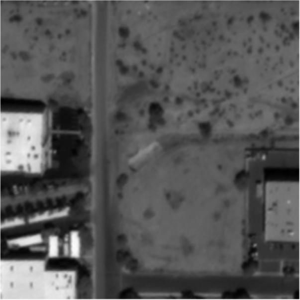 | 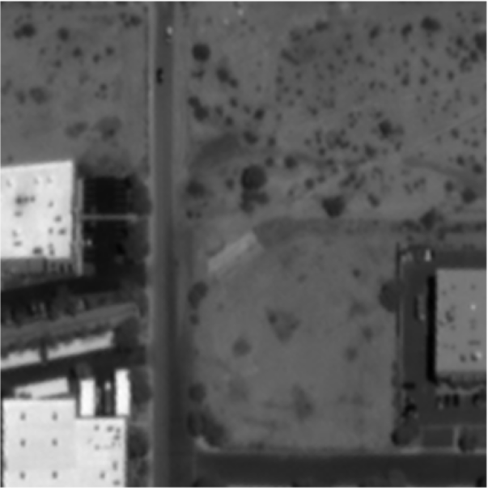 | 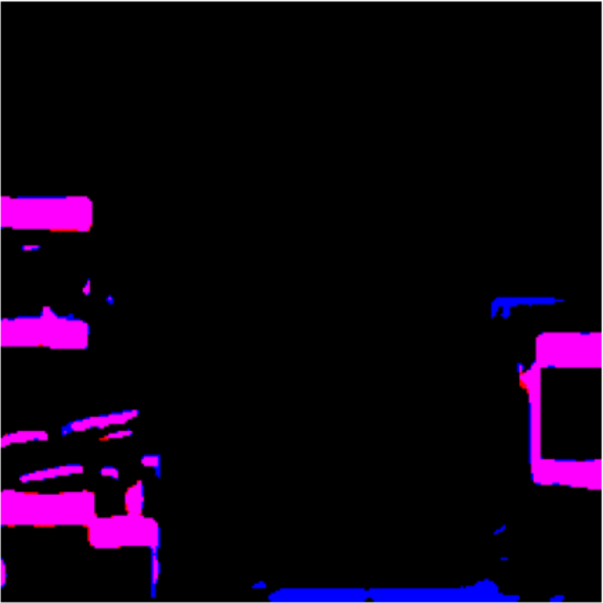 | 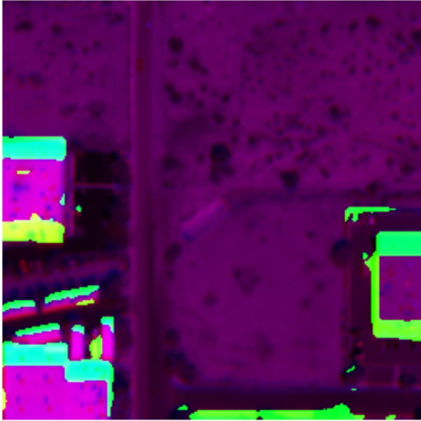 |
| **3** | 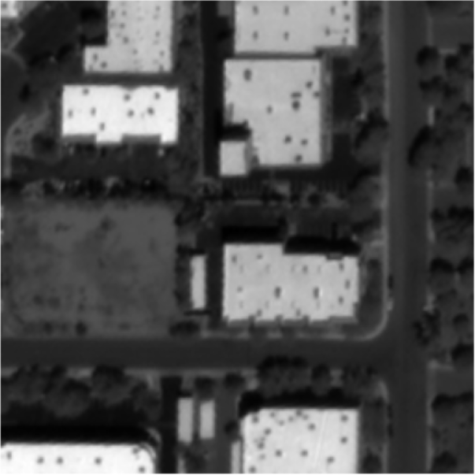 | 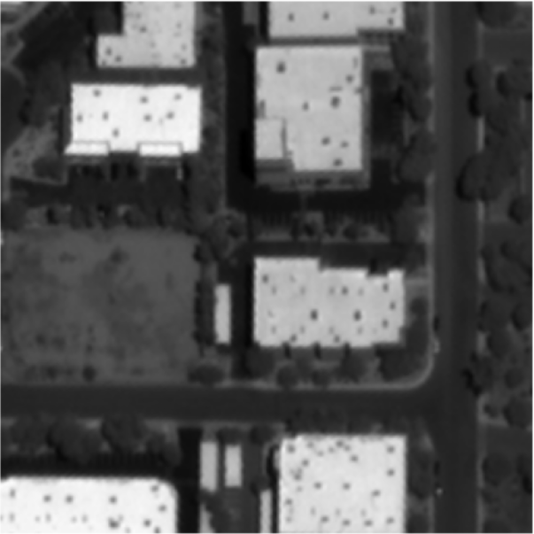 | 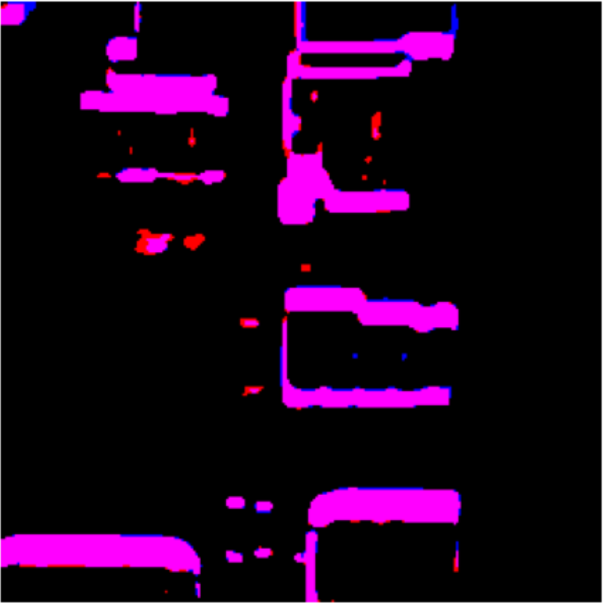 | 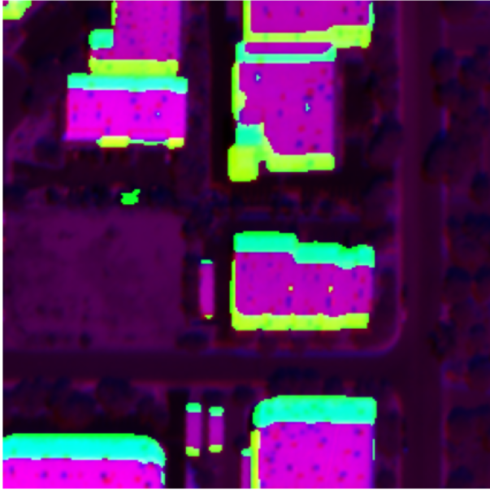 |
| **4** | 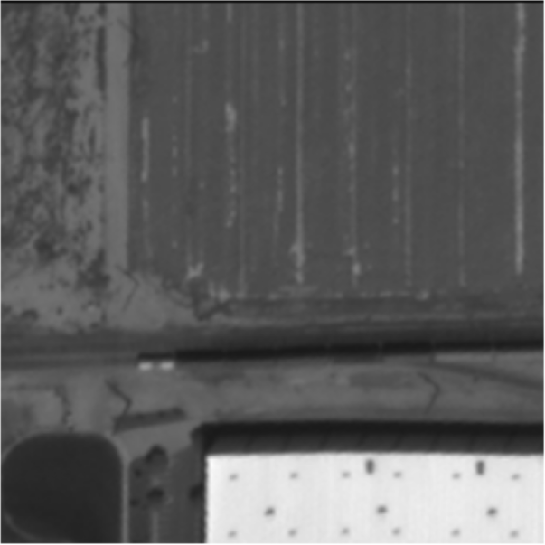 | 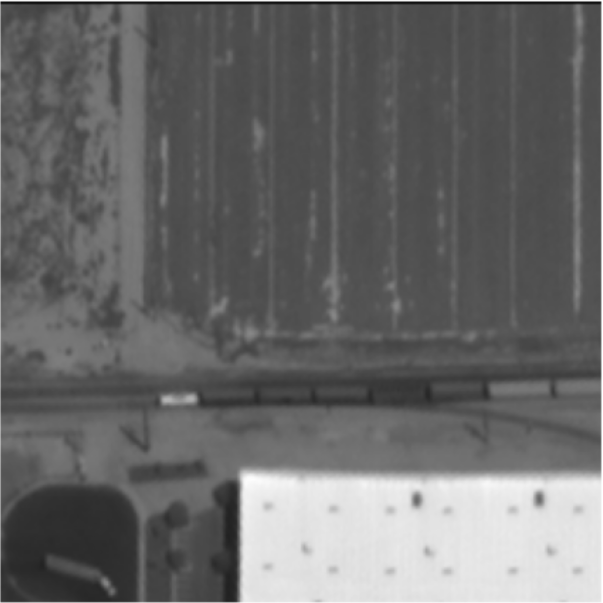 | 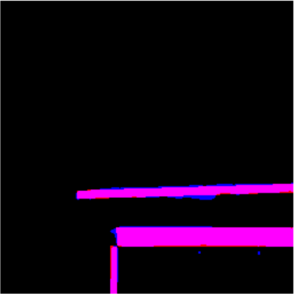 | 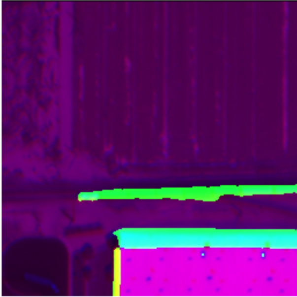 |

🖼️ На валидационной выборке

*Для валидационной выборки приводится только результат предсказания детектора изменений.*  
*Маска: Синий канал (B) — предсказание СНС.*  
*Композит: R — изображение 1; G — предсказание СНС; B — изображение 2.*

| Сюжет | Снимок 1 | Снимок 2 | Маска | Композит |
| :---: | :---: | :---: | :---: | :---: |
| **5** | 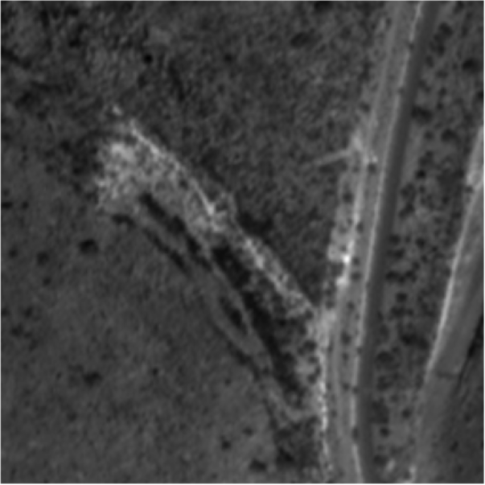 | 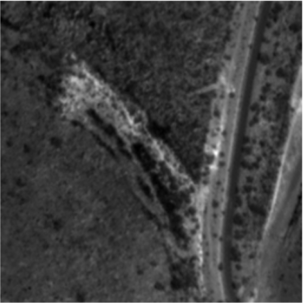 | 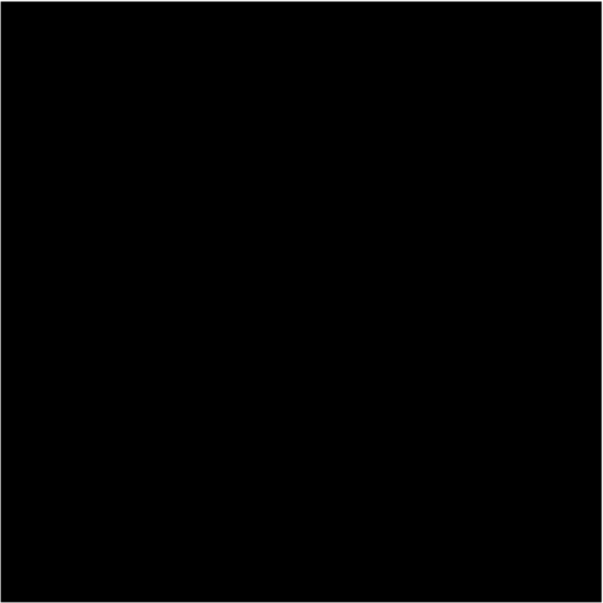 | 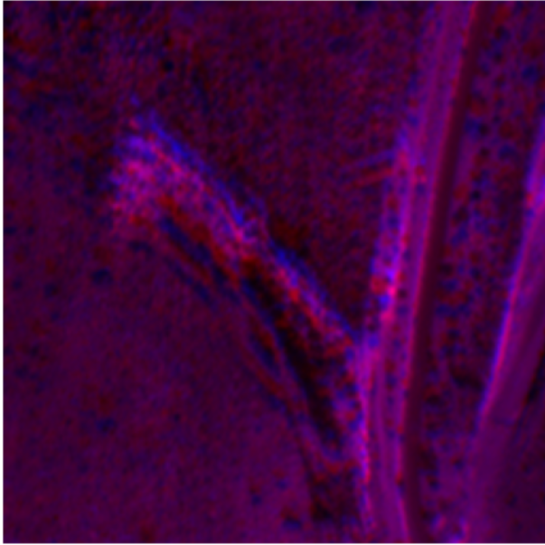 |
| **6** | 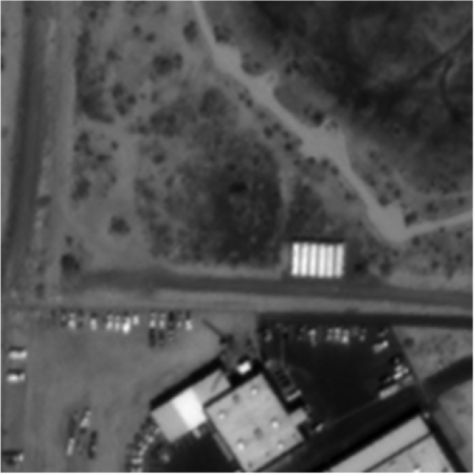 | 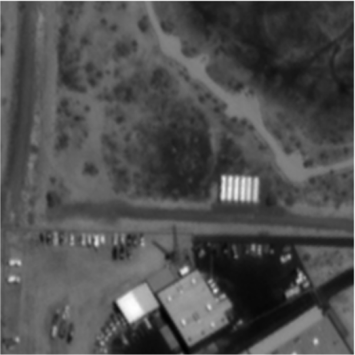 | 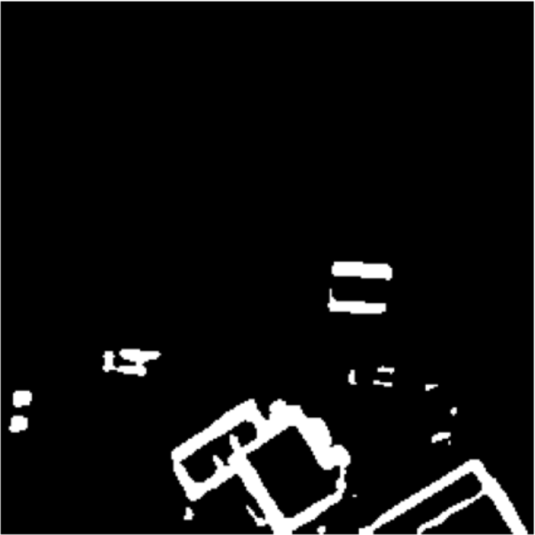 | 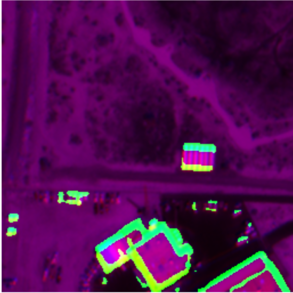 |
| **7** | 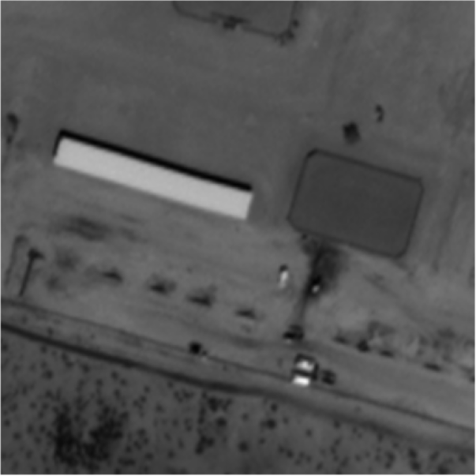 | 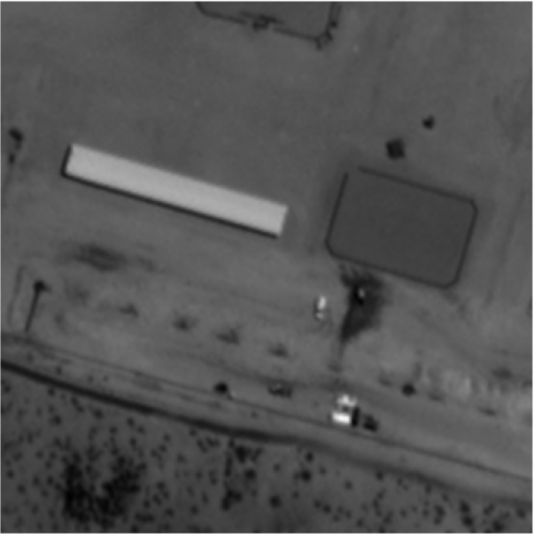 | 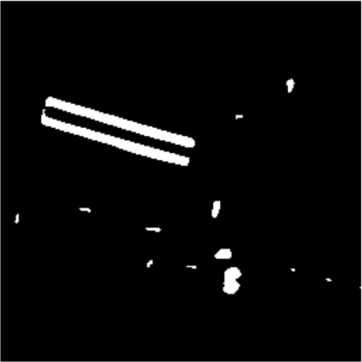 | 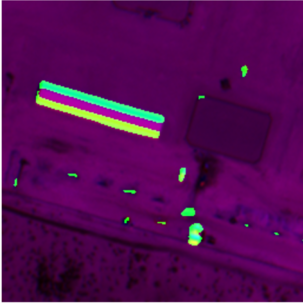 |
| **8** | 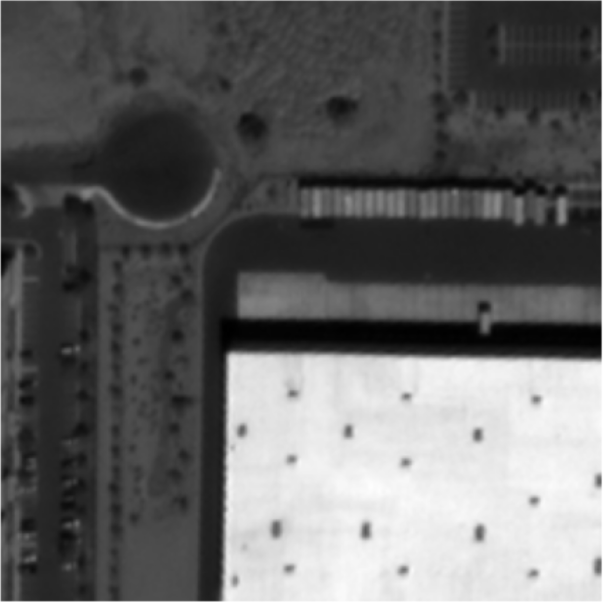 |  |  |  |
| **9** |  |  |  |  |
| **10** |  |  |  |  |
| **11** |  |  |  |  |
| **12** |  |  |  |  |

